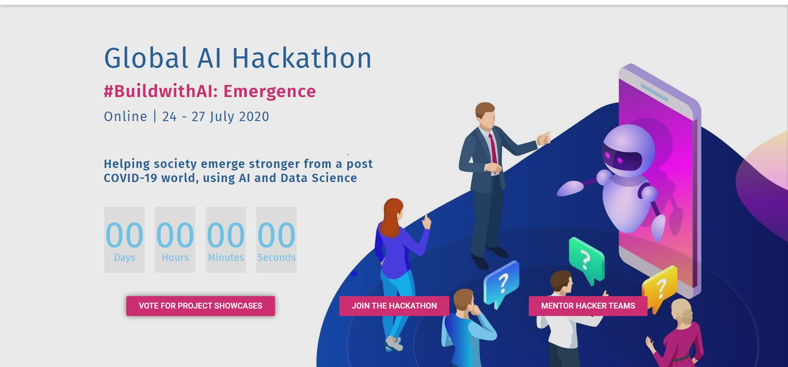

# BuildWithAI / NLP_challenge
This is in respect with the hackathon at Hackmakers were the team has undertaken a NLP challenge.

# Team Soothe / Flashpoint
This repository contains all code files and data we used in the Global AI Hackathon Challenge Competition titled #BuildwithAI : Emergence. In this project, we utilized web scraping techniques to collect data from multi-platforms, leveraged NLP techniques to process the text data, analyzed the data by sentiment analysis and topic modeling, and created a dashboard to present the results. 

## Motivation
There is a lot of going on in the world right now due to the Covid-19 pandemic and we needed to understand and study the public sentiments regarding Covid-19 along with how media and newspapers have impact over it.

## The dataset can be used for 
- To study people's interactions on Twitter during COVID-19 period
- To study public media's behavior during COVID-19 period
- To study people's emotion change during COVID-19 period
- To find the impact of public media on people's emotion during COVID-19 period

